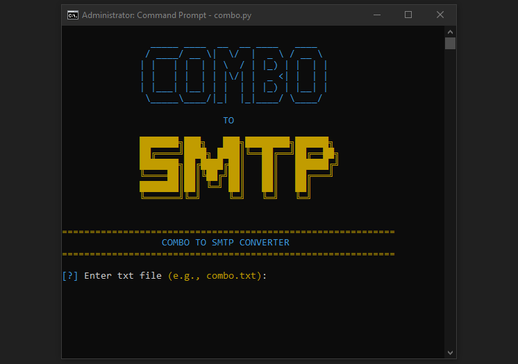

📧 Email to SMTP Converter 📨
==============================

A simple tool that converts email:password combos into formatted SMTP credentials.

✨ Features
-----------
- 🖼️ Cool ASCII Banner
- 📂 Reads input from a .txt file
- 🔍 Validates email format
- 🔐 Detects SMTP server from common domains
- 📝 Saves results to smtp_credentials.txt
- 🎨 Colorful and user-friendly terminal output

🛠️ How to Use
--------------
1. Put your combo file (e.g., combo.txt) in the same folder as the .exe
2. Run `EmailToSMTP.exe`
3. Enter the name of your combo file when asked (example: combo.txt)
4. Wait for the tool to process and save results

📦 Output
---------
Your results will be saved in:
smtp_credentials.txt

Format:
`smtp.server.com:port:email:password`

📘 Example Combo Input
----------------------
`user1@gmail.com:pass123`

`user2@yahoo.com:pass456`

✅ Output will be:
----------------------
`smtp.gmail.com:587:user1@gmail.com:pass123`

`smtp.mail.yahoo.com:587:user2@yahoo.com:pass456`

💡 Notes
--------
- Only valid emails are processed ✅  
- Invalid lines are skipped ⚠️  
- Works completely offline 🔌  

📢 Disclaimer
-------------
⚠️ This tool is provided for **educational and legitimate use only**.  
❌ Do NOT use it for spam, unauthorized access, or any illegal activity.  
✅ Always comply with your local laws and email service provider policies.
